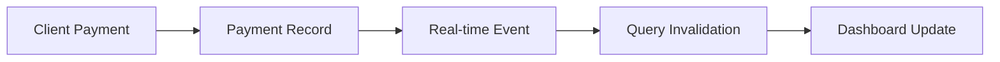

# Business Dashboard and Payment System Integration

This document outlines how the payment system is integrated with the business dashboard to ensure real-time updates when clients make payments.

## Overview

When a client makes a payment, the business dashboard should be immediately updated to reflect:

1. New revenue
2. New client (if applicable)
3. Updated booking status (if applicable)

## Real-time Data Flow

The flow of real-time data from client payments to business dashboard happens through these steps:

1. Client makes a payment via M-Pesa, Paystack, or other payment methods
2. Payment is recorded in one or more of these tables:
   - `payments`
   - `payment_transactions`
   - `client_business_transactions`
   - `bookings` (payment_status field)

3. Real-time subscriptions in `useClientPaymentMonitor` detect these changes
4. Query invalidation is triggered for the business dashboard
5. Business dashboard automatically refreshes with new data

## Key Components

### 1. Client-Side Monitoring (`useClientPaymentMonitor`)

- Subscribes to all payment-related tables
- Ensures proper invalidation of dashboard queries
- Provides fallback polling mechanism

### 2. Dashboard Real-time Monitoring (`useDashboardRealtime`)

- Directly subscribes to payment and transaction tables
- Shows toast notifications for business owners
- Invalidates dashboard queries on changes

### 3. Dashboard Data Queries (`useDashboardData`)

- Fetches aggregate statistics from multiple tables
- Updates in real-time when query invalidation occurs
- Provides consistent data for revenue, clients, and bookings

## Troubleshooting

If the business dashboard is not updating in real-time when clients make payments:

1. **Check Real-time Subscriptions**: Verify that all required real-time channels are active using the `runComprehensiveRealtimeTest` function.

2. **Query Invalidation**: Confirm that query invalidation is happening by checking the browser console for invalidation logs.

3. **Database Updates**: Verify that payment data is being properly recorded in the database tables.

4. **Manual Refresh**: Use the dashboard refresh function if automatic updates are not working.

## Implementation Details

### Client Payment to Dashboard Update Pathway

### Critical Query Keys for Invalidation

When a client payment is made, these query keys should be invalidated:

- `['dashboard-stats', businessId]`
- `['business-revenue', businessId]`
- `['business-data', businessId]`
- `['transactions', businessId]`
- `['client-business-transactions', businessId]`
- `['payment-transactions', businessId]`
- `['payments', businessId]`

### Enhanced Real-time Manager Role

The `EnhancedRealtimeManager` provides reliable real-time subscriptions that:

1. Automatically reconnect when disconnected
2. Handle errors gracefully
3. Manage subscription lifecycle
4. Provide status information for troubleshooting

## Testing Procedure

To test if the dashboard updates when a client makes a payment:

1. Open the business dashboard in one window
2. Complete a client payment in another window
3. Verify that the dashboard updates with:
   - Increased revenue numbers
   - New transaction in the recent transactions list
   - Updated client count (if a new client)
   - Updated booking status (if applicable)
